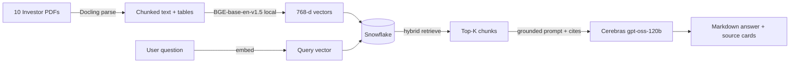

# RAG System — Investor Document Q&A

A Retrieval-Augmented Generation system over a corpus of investor-presentation
PDFs. Ask natural-language questions; get **source-grounded answers with
inline citations** that link back to the exact page in the original document.

Built as a take-home assessment. The brief, source PDFs, design notes, and
architecture diagrams are all included in this repo.

---

## What's in the box

```
RAG_System/
├── README.md                                    ← you are here
├── Vectera_RAG_System_Technical_Assessment.pdf  ← the original brief
├── app/                                         ← the application code
│   ├── rag_system/                              ← Python package (~1.7k LoC)
│   │   ├── config/                              ← typed settings
│   │   ├── ingest/                              ← Docling parse → chunk → embed
│   │   ├── storage/                             ← Snowflake schema + DAO
│   │   ├── retrieval/                           ← hybrid dense + lexical + RRF
│   │   ├── generation/                          ← prompt + citations
│   │   ├── llm_providers/                       ← swappable LLM/embed/vision
│   │   └── ui/                                  ← Streamlit chat
│   ├── eval/                                    ← Q&A set + run_eval.py
│   ├── scripts/                                 ← bulk-ingest CLI + smoke tests
│   ├── tests/
│   ├── .env.example                             ← copy to .env and fill in
│   ├── Makefile
│   ├── requirements.txt
│   └── README.md                                ← deep technical notes
├── Documents/                                   ← 10 source PDFs (the corpus)
├── design/
│   └── 01_system_design.md                      ← 17-section design doc
└── docs/
    ├── architecture.drawio                      ← editable system diagram
    └── architecture.md                          ← Mermaid + per-stage notes
```

---

## Architecture at a glance



**Full diagram:** [`docs/architecture.drawio`](docs/architecture.drawio) — open in
[diagrams.net](https://app.diagrams.net) (File → Open).
Mermaid version + per-stage notes: [`docs/architecture.md`](docs/architecture.md).

**Two distinct planes:**

1. **Ingestion (offline, batch):** PDF → Docling (layout-aware, batched
   page processing) → page-aware chunker → local sentence-transformer
   embeddings (BGE-base-en-v1.5, 768d) → Snowflake upsert. Idempotent by
   file checksum.
2. **Query (online, stateless):** user question → embed → hybrid retrieve
   (dense cosine ∪ lexical LIKE, fused with Reciprocal Rank Fusion) → format
   numbered sources → strict citation prompt → Cerebras `gpt-oss-120b` →
   parse `[N]` markers → render in chat with clickable source cards.

---

## Quick start (Windows / macOS / Linux)

### 1. Prerequisites

- **Python 3.11+** (3.13 tested)
- **Git**
- **Free accounts:**
  - **Snowflake trial** — https://signup.snowflake.com (any cloud, any region; takes 2 min)
  - **Cerebras API key** — https://cloud.cerebras.ai (free tier, takes 1 min)
  - **Gemini API key** *(optional)* — https://aistudio.google.com/apikey (only needed for chart-image descriptions; off by default)

### 2. Clone

```bash
git clone https://github.com/srinivasangr/RAG_System_vectera.ai.git
cd RAG_System_vectera.ai
```

### 3. Set up the Python environment

**Windows (PowerShell):**
```powershell
cd app
python -m venv .venv
.\.venv\Scripts\Activate.ps1
pip install --upgrade pip
pip install -r requirements.txt
```

**macOS / Linux (bash/zsh):**
```bash
cd app
python3 -m venv .venv
source .venv/bin/activate
pip install --upgrade pip
pip install -r requirements.txt
```

> First install pulls down Docling (~2 GB with PyTorch deps) and
> sentence-transformers. Plan for ~5 min on a fast connection.

### 4. Configure credentials

```bash
cp .env.example .env       # macOS / Linux
# OR
copy .env.example .env     # Windows PowerShell
```

Then open `.env` in your editor and fill in:

```ini
# Required
SNOWFLAKE_ACCOUNT=YOUR_ACCOUNT_IDENTIFIER
SNOWFLAKE_USER=YOUR_USERNAME
SNOWFLAKE_PASSWORD=YOUR_PASSWORD
CEREBRAS_API_KEY=csk-...

# Optional (only if you want chart-image descriptions)
GEMINI_API_KEY=
```

**Finding your Snowflake account identifier:** Log in to Snowflake →
click your account name (bottom-left of Snowsight) → **Account → View
account details** → copy the **"Account identifier"** field (looks like
`ABC12345-XY67890`).

### 5. Initialize the Snowflake schema

```bash
python -m rag_system.storage.init_snowflake
```

Creates:
- `RAG_WH` warehouse (XSMALL, auto-suspends in 60s — won't burn credits while idle)
- `RAG_DB.RAG_SCHEMA`
- Tables: `documents`, `chunks` (with `VECTOR(FLOAT, 768)`), `chunk_images`, `query_log`

Idempotent — re-running is a no-op.

### 6. Ingest the 10 PDFs

```bash
python scripts/ingest_all_pending.py --no-vision
```

What this does:
- Scans `../Documents/` for PDFs
- Skips any whose checksum already exists in Snowflake (idempotent)
- For each pending PDF: parse → chunk → embed → upsert (one at a time)

**Expected runtime: ~40 minutes** on a typical laptop (CPU-bound on Docling parse).
The first PDF (BXP Morning Session, 152p) is the longest (~10 min);
smaller ones complete in 1-3 min each.

Monitor progress from another terminal:
```bash
python scripts/_full_status.py
```

### 7. Run the chat UI

```bash
streamlit run rag_system/ui/streamlit_app.py
```

Open **http://localhost:8501**.

You should see all 10 sources in the sidebar, a chat input at the bottom,
and a `⚙ Model` popover.

Try these queries:

| Query | What it tests |
|---|---|
| *What is Digital Realty's leverage ratio?* | Single-fact retrieval |
| *How did Digital Realty change between Dec 2025 and Mar 2026?* | Version-aware comparison |
| *Which REITs in this corpus focus on data centers?* | Cross-document reasoning |
| *What is Apple's stock price today?* | Should refuse cleanly (out of corpus) |

### 8. (Optional) Run the eval

```bash
python -m eval.run_eval
```

Reports Recall@k, MRR, must-contain rate, and refusal correctness against a
14-question hand-written eval set.

---

## Key design choices

| Choice | Why |
|---|---|
| **Snowflake** for storage + vector search | Required by brief. Cortex AI functions are blocked on trial — so we use `VECTOR_COSINE_SIMILARITY` (pure SQL, works on every tier) + external embeddings. |
| **Docling** for PDF parsing | Layout-aware, handles slide-heavy investor decks, outputs structured Markdown including tables. |
| **Local BGE-base-en-v1.5** for embeddings | No API rate limits, no quota, free, 768d matches schema. Earlier Gemini-based runs hit the 100 RPM free-tier limit constantly. |
| **Cerebras `gpt-oss-120b`** for answer generation | Frontier-class OSS model served at very low latency. Free tier is generous enough for the demo. |
| **Hybrid retrieval (dense ∪ lexical, RRF fused)** | Investor decks are dense with tickers, metric acronyms (FFO, NOI, AFFO), and named figures — pure dense misses exact-string matches. RRF is parameter-free. |
| **Page-aware chunking** | Citations need precise page numbers; tables are isolated so structured rows stay intact. |
| **Strict citation prompt** | Forces `[N]` markers on every factual claim, requires attribution when sources disagree, refuses cleanly on insufficient evidence. |
| **Streamlit chat UI (NotebookLM-style)** | Brief recommended Streamlit. Sidebar shows source toggles, source cards under each answer open a detail modal (Perplexity / NotebookLM pattern). |

---

## How the brief's "key capabilities" are handled

| Capability | Where it's solved |
|---|---|
| **Version awareness** | Filenames parsed to `company` + `doc_date` + `version_label`. Denormalized onto every chunk row. Prompt instructs the model to attribute by version. Optional **recency boost** auto-activates when the query contains "latest"/"current"/"recent". |
| **Cross-document conflicts** | Retrieval pulls top-K from all docs without per-doc quotas. Prompt explicitly forbids averaging or silently picking one side — disagreements must be surfaced with attribution. |
| **Tables** | Extracted by Docling as Markdown tables, stored as their own chunks (`chunk_type='table'`). |
| **Charts / figures** | Optional vision pass (Gemini Flash) describes each chart image and stores both the description and the source PNG. **Off by default** in this build because Gemini's free-tier daily quota was exhausted during development. Toggle on via the UI checkbox when quota refreshes. |

---

## Known limitations

- **Chart-image descriptions are off by default.** The text + table content
  fully covers most questions. To enable: toggle "🎨 Describe chart images"
  in the Sources panel — requires a Gemini API key with remaining
  free-tier quota.
- **OCR is off.** Investor decks are digital-native; OCR adds 5-10× parse
  time and Tesseract quality on slide layouts is poor. Scanned PDFs would
  return no text.
- **Single-tenant.** Multi-tenant access control is sketched in the
  `chunks` schema (you could add a `tenant_id` column + Snowflake row
  access policy) but not enforced.
- **Lexical search uses `LIKE`** rather than Snowflake's full-text
  `SEARCH()` (gated on higher tiers). Fast enough at this corpus size.
- **No reranker.** A cross-encoder rerank step between candidate-30 and
  top-8 would improve recall on harder questions; deferred for time.

---

## What I'd improve with more time

- Re-enable Gemini Vision and re-ingest with chart-image descriptions for all 10 docs
- Cross-encoder reranker (`bge-reranker-base` or Cohere Rerank)
- Multi-turn chat with conversation memory
- Streaming responses in the UI
- Snowflake row-access policies for multi-tenant isolation
- HyDE / query rewriting for harder questions
- Eval harness wired into CI (fail PR if Recall@k drops)

See [`design/01_system_design.md`](design/01_system_design.md) for the full
17-section design document including every tradeoff considered.

---

## Troubleshooting

| Problem | Fix |
|---|---|
| `EMBED_TEXT_768 is not available for trial accounts` | Expected — we don't use Cortex AI. Make sure `EMBEDDING_PROVIDER=local` in `.env`. |
| Streamlit hangs during a multi-file upload | Known issue with Streamlit + Docling worker threads on Windows. Upload PDFs **one at a time** via the UI, or use `python scripts/ingest_all_pending.py` for bulk. |
| Snowflake `RESOURCE_EXHAUSTED 429` from Gemini | You've hit a Gemini free-tier rate limit. Wait a minute (RPM) or until midnight Pacific (RPD). Or run with `--no-vision`. |
| Docling `std::bad_alloc` on a specific page batch | Memory pressure during image rendering. The parser auto-retries with smaller batches (10 → 5 → 2). If still failing, that PDF page is genuinely too large; skip it. |
| `Connecting to GLOBAL Snowflake domain` hangs | Network blocked from Snowflake. Check firewall / VPN. |

---

## License

Submitted as an assessment artifact — no public license. Source PDFs in
`Documents/` are publicly distributed investor presentations from their
respective REITs.
