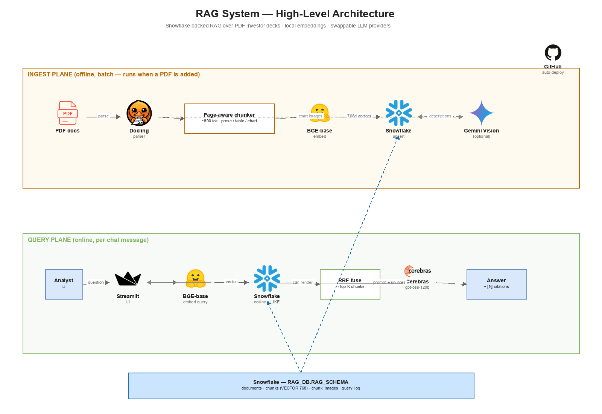
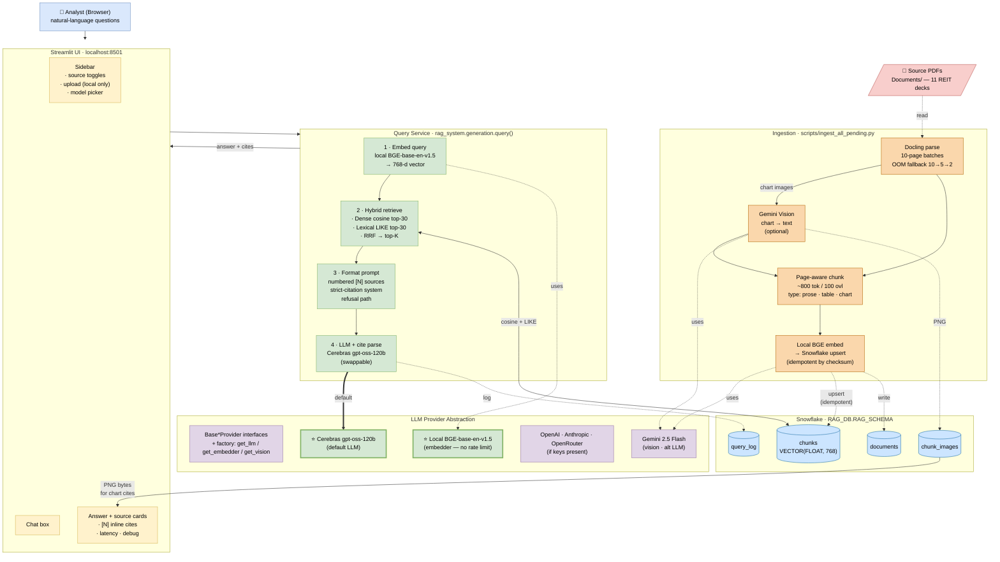
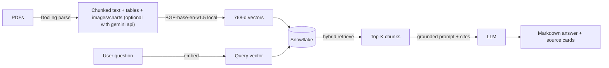

# RAG System — Document Q&A

A Retrieval-Augmented Generation system over a corpus of documents(PDFs). Ask natural-language questions; 

> **Try it live →** [ragsystemchatbot.streamlit.app](https://ragsystemchatbot.streamlit.app/)
> *(read-only — chats against  pre-ingested documents; uploads disabled on the hosted version, see [docs/streamlit_cloud_setup.md](docs/streamlit_cloud_setup.md) for why)*

The brief, source PDFs, and architecture
diagrams are all included in this repo.

---

## High-level architecture



### Functional flow



*Full architecture details → [`docs/architecture.md`](docs/architecture.md)*

---

## Code structure

```
RAG_System/
├── README.md                                    ← you are here
├── Dockerfile · docker-compose.yml              ← optional containerised run
├── setup.sh · setup.ps1                         ← one-command env + Snowflake bootstrap
├── requirements.txt                             ← mirrored at root for Streamlit Cloud
├── app/                                         ← the application code
│   ├── rag_system/                              ← Python package (~1.7k LoC)
│   │   ├── config/                              ← typed settings (pydantic)
│   │   ├── ingest/                              ← Docling parse → chunk → embed
│   │   ├── storage/                             ← Snowflake schema + DAO
│   │   ├── retrieval/                           ← hybrid dense + lexical + RRF
│   │   ├── generation/                          ← prompt + citations
│   │   ├── llm_providers/                       ← swappable LLM/embed/vision
│   │   └── ui/                                  ← Streamlit chat
│   ├── eval/                                    ← Q&A set, runner, RAGAS metrics, RESULTS.md
│   ├── tests/                                   ← pytest (unit + integration)
│   ├── scripts/                                 ← bulk-ingest CLI + ops helpers
│   ├── .env.example                             ← copy to .env and fill in
│   ├── Makefile · pytest.ini · requirements.txt
├── Documents/                                   ← (gitignored) drop your own PDFs here
└── docs/
    ├── architecture.drawio · architecture.md    ← system diagram 
    └── streamlit_cloud_setup.md                 ← hosted deploy guide
```

---

## Architecture at a glance



**Two distinct planes:**

1. **Ingestion (offline, batch):** PDF → Docling (layout-aware, batched
   page processing) → page-aware chunker → loal sentence-transformer
   embeddings (BGE-base-en-v1.5, 768d) → Snowflake upsert. Idempotent by
   file checksum.
2. **Query (online, stateless):** user question → embed → hybrid retrieve
   (dense cosine ∪ lexical LIKE, fused with Reciprocal Rank Fusion) → format
   numbered sources → strict citation prompt → LLM (Cerebras `gpt-oss-120b` or gemini models) →
   parse `[N]` markers → render in chat with clickable source cards.

---

## Quick start (Windows / macOS / Linux)

### 1. Prerequisites

- **Python 3.11+**
- **Git**
- **Free accounts:**
  - **Snowflake trial** — https://signup.snowflake.com
  - **Cerebras API key** — https://cloud.cerebras.ai 
  - **Gemini API key** *(optional)* — https://aistudio.google.com/apikey (only needed for chart-image descriptions chunking; off by default)

### 2. Clone

```bash
git clone https://github.com/srinivasangr/RAG_System_vectera.ai.git
cd RAG_System_vectera.ai
```

### 3. Set up the Python environment

Pick **either** the helper script (recommended — does venv + deps + .env
check + Snowflake schema init in one go) **or** the manual flow.

**Helper script:**
```bash
./setup.sh           # macOS / Linux
# OR
.\setup.ps1          # Windows PowerShell
```
If `app/.env` doesn't exist, the script copies the example for you and
asks you to fill it in (step 4 below), then re-run.

**Manual venv:**

Windows (PowerShell):
```powershell
cd app
python -m venv .venv
.\.venv\Scripts\Activate.ps1
pip install --upgrade pip
pip install -r requirements.txt
```

macOS / Linux:
```bash
cd app
python3 -m venv .venv
source .venv/bin/activate
pip install --upgrade pip
pip install -r requirements.txt
```

First install pulls down Docling + PyTorch + sentence-transformers
(~2 GB total). 

**Or via Docker** (everything containerised — slower first build, fastest
to run on a clean machine):

```bash
cp app/.env.example app/.env       # fill it in
docker compose up                  # builds the image, runs at localhost:8501
```
The compose file persists the BGE / Docling model caches between rebuilds.

### 4. Configure credentials

```bash
cp .env.example .env       # macOS / Linux
# OR
copy .env.example .env     # Windows PowerShell
```

Then open `.env` in your editor and fill in:

```ini
# Required
SNOWFLAKE_ACCOUNT=YOUR_ACCOUNT_IDENTIFIER
SNOWFLAKE_USER=YOUR_USERNAME
SNOWFLAKE_PASSWORD=YOUR_PASSWORD
CEREBRAS_API_KEY=csk-...

# Optional (only if you want chart-image descriptions)
GEMINI_API_KEY=
```

**Finding your Snowflake account identifier:** Log in to Snowflake →
click your account name (bottom-left of Snowsight) → **Account → View
account details** → copy the **"Account identifier"** field (looks like
`ABC12345-XY67890`).

### 5. Initialize the Snowflake schema

```bash
python -m rag_system.storage.init_snowflake
```

Creates:
- `RAG_WH` warehouse (XSMALL, auto-suspends in 60s — won't burn credits while idle)
- `RAG_DB.RAG_SCHEMA`
- Tables: `documents`, `chunks` (with `VECTOR(FLOAT, 768)`), `chunk_images`, `query_log`

Idempotent — re-running is a no-op.

### 6. Ingest PDFs

**Drop your own PDFs into `Documents/`** (any folder of PDFs works — the
default is the project's `Documents/` directory, configurable via the
`DOCUMENTS_DIR` env var).

If you just want to chat against an already-ingested corpus, skip this
step and use the **hosted version** at the top of this README.

```bash
python scripts/ingest_all_pending.py --no-vision
```

What this does:
- Scans `../Documents/` for PDFs
- For each pending PDF: parse → chunk → embed → upsert (one at a time)
- Idempotent — re-running skips any PDF whose sha256 checksum is already in Snowflake

**Expected runtime: ~2–3 min per document approx based on presentation pdfs** on a local machine pc
(CPU-bound on Docling parse).

Monitor progress from another terminal:
```bash
python scripts/_full_status.py
```

### 7. Run the chat UI

```bash
streamlit run rag_system/ui/streamlit_app.py
```

Open **http://localhost:8501**.


Try these queries:

| Query | What it tests |
|---|---|
| *What is Digital Realty's leverage ratio?* | Single-fact retrieval |
| *How did Digital Realty change between Dec 2025 and Mar 2026?* | Version-aware comparison |
| *Which [document] in this corpus focus on data centers?* | Cross-document reasoning |
| *What is Apple's stock price today?* | Should refuse cleanly (out of corpus) |

### 8. Run the tests

```bash
pytest                       # all tests; integration ones auto-skip if creds missing
pytest tests/unit            # unit only — fast, no creds required
pytest tests/integration     # integration only (needs Snowflake / Gemini / Cerebras)
```

See [`app/tests/README.md`](app/tests/README.md) for the marker-driven
skip policy.

### 9. Run the eval

```bash
python -m eval.run_eval                 # core metrics only
python -m eval.run_eval --ragas         # + RAGAS-style LLM-judge metrics (slower)
```

Latest results: **[`app/eval/RESULTS.md`](app/eval/RESULTS.md)** —
Recall@8 82%, refusal correctness 100%, answer relevance 96%,
faithfulness 70%.

---

## Key design choices

| Choice | Why | Notes |
|---|---|---|
| **Snowflake** for storage + vector search | Uses `VECTOR_COSINE_SIMILARITY` (pure SQL, works on every tier) + external embeddings | Cortex AI is blocked on trial accounts, so we never depend on it |
| **Docling** for PDF parsing | Layout-aware, handles slide-heavy investor decks, outputs structured Markdown including tables | Best of the layout-aware options (vs. LlamaParse / unstructured.io); chart images can be turned into searchable text via the optional Gemini vision pass |
| **Local `BGE-base-en-v1.5`** for embeddings | No API rate limits, runs on CPU, same 768d that matches the Snowflake schema | Earlier Gemini embedding runs hit the 100 RPM free-tier limit constantly — local removes that variable |
| **Cerebras `gpt-oss-120b`** for answer generation | Frontier-class OSS model served at very low latency, generous free tier | The LLM is a swappable layer — any of Cerebras / Gemini / OpenAI / Anthropic / OpenRouter can be selected at runtime from the UI |
| **Hybrid retrieval (dense ∪ lexical, RRF fused)** | Investor decks are dense with tickers + metric acronyms (FFO, NOI, AFFO) — pure dense misses exact-string matches; pure lexical misses paraphrases | RRF is parameter-free and robust to score-scale differences |
| **Page-aware chunking** | Citations need precise page numbers; tables are isolated as their own chunks so structured rows stay intact | Each chunk carries denormalized `company` + `doc_date` so filters push down to SQL |
| **Strict citation prompt** | Forces `[N]` markers on every factual claim, requires attribution when sources disagree, refuses cleanly on insufficient evidence. |
| **Streamlit chat UI (NotebookLM-style)** | Brief recommended Streamlit. Sidebar shows source toggles, source cards under each answer open a detail modal (Perplexity / NotebookLM pattern). |


|---|---|
| **Version awareness** | Filenames parsed to `company` + `doc_date` + `version_label`. Denormalized onto every chunk row. Prompt instructs the model to attribute by version. Optional **recency boost** auto-activates when the query contains "latest"/"current"/"recent". |
| **Cross-document conflicts** | Retrieval pulls top-K from all docs without per-doc quotas. Prompt explicitly forbids averaging or silently picking one side — disagreements must be surfaced with attribution. |
| **Tables** | Extracted by Docling as Markdown tables, stored as their own chunks (`chunk_type='table'`). |
| **Charts / figures** | Optional vision pass (Gemini Flash) describes each chart image and stores both the description and the source PNG. **Off by default** in this build because Gemini's free-tier daily quota was exhausted during development. Toggle on via the UI checkbox when quota refreshes. |

---


## What I'd improve with more time

- Re-enable Gemini Vision and re-ingest with chart-image descriptions for all 10 docs
- Cross-encoder reranker (`bge-reranker-base` or Cohere Rerank)
- Multi-turn chat with conversation memory
- Streaming responses in the UI(optional)
- Snowflake row-access policies for multi-tenant isolation
- HyDE / query rewriting for harder questions
- Eval harness wired into CI (fail PR if Recall@k drops)


---

## Troubleshooting

| Problem | Fix |
|---|---|
| `EMBED_TEXT_768 is not available for trial accounts` | Make sure `EMBEDDING_PROVIDER=local` in `.env`. |
| Streamlit hangs during a multi-file upload | Known issue with Streamlit + Docling worker threads on Windows. Upload PDFs **one at a time** via the UI, or use `python scripts/ingest_all_pending.py` for bulk. |
| Snowflake `RESOURCE_EXHAUSTED 429` from Gemini | You've hit a Gemini free-tier rate limit. Wait a minute (RPM) or until midnight Pacific (RPD). Or run with `--no-vision`. |
| Docling `std::bad_alloc` on a specific page batch | Memory pressure during image rendering. The parser auto-retries with smaller batches (10 → 5 → 2). If still failing, that PDF page is genuinely too large; skip it. |
| `Connecting to GLOBAL Snowflake domain` hangs | Network blocked from Snowflake. Check firewall / VPN. |

---

