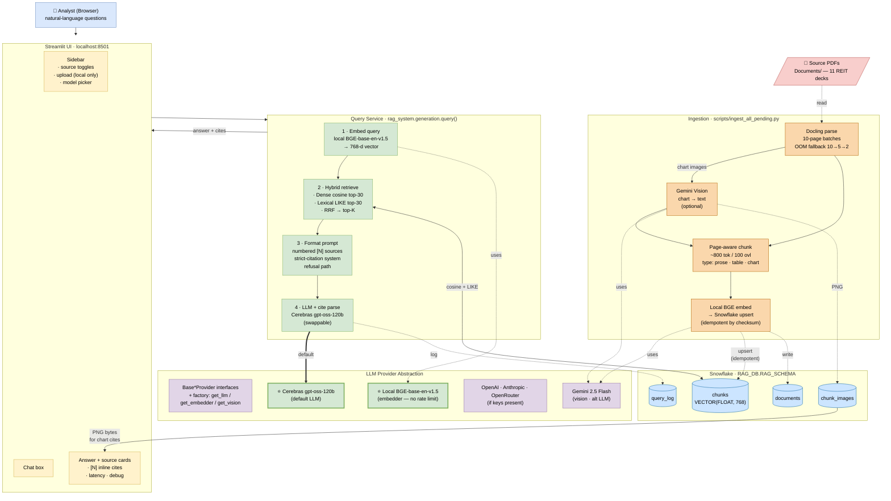

# System Architecture

This repo ships two views of the same system:

| File | Purpose | How to view |
|---|---|---|
| [`architecture.drawio`](architecture.drawio) | **High-level diagram with vendor logos** (the “glossy” one) — generated by [`_build_diagram.py`](_build_diagram.py) with 9 embedded logos | Open in [app.diagrams.net](https://app.diagrams.net) → **File → Open** → pick the file. Or use the VS Code **Draw.io Integration** extension. |
| Mermaid block below | **Functional flow** — renders inline on GitHub | Just scroll ↓ |

The two diagrams cover the same system; the drawio one foregrounds **who the vendors are**, the Mermaid one foregrounds **how data moves**.

---

## Functional flow (Mermaid)



---

## Two distinct planes

### 1. Query plane (online, stateless, runs on every user click)

```
Browser  →  Streamlit  →  query()  ──┬─→ Gemini (embed query, 768d)
                                     │
                                     ├─→ Snowflake (dense cosine + LIKE)
                                     │      ↓
                                     │   top-K chunks (RRF-fused)
                                     │
                                     └─→ Cerebras gpt-oss-120b
                                            ↓
                                       answer + [N] citations
                                            ↓
                                       chunk_images.image_b64 for chart cites
                                            ↓
                                       rendered in UI
```

**Latency budget** (observed on Digital Realty Dec 2025, top-k 8):

| Stage | p50 |
|---|---|
| Query embedding (Gemini API) | 300–500 ms |
| Hybrid retrieval (Snowflake) | 2 000–3 500 ms |
| Prompt format + token count | < 5 ms |
| LLM generation (Cerebras gpt-oss-120b) | 500–1 500 ms |
| **End-to-end** | **~3–6 s** |

### 2. Ingest plane (offline, batch, one-shot or on file change)

```
Documents/*.pdf  ⇢  Docling parse (page batches of 5)
                  ⇢  per page: Gemini Vision describes each chart image
                                (skips logos, tiny, extreme-aspect)
                  ⇢  chunk_page() — tag prose / table / chart_description
                  ⇢  Gemini embeddings (768d, batched)
                  ⇢  Snowflake upsert
                        - documents (one row per PDF)
                        - chunks (text + embedding + metadata)
                        - chunk_images (PNG bytes for chart_description chunks)
```

**Idempotency:** every PDF is hashed (sha256). Re-running the pipeline on an
unchanged file is a no-op; on a changed file it replaces the document's rows
inside a single transaction.

---

## Key components, in code

| Concern | Module | What it does |
|---|---|---|
| Settings | `rag_system/config/settings.py` | Typed Pydantic settings loaded from `.env` |
| PDF parsing | `rag_system/ingest/parse.py` | Docling, batched by page, returns per-page Markdown + image bytes |
| Filename → metadata | `rag_system/ingest/metadata.py` | Regex-driven company/date/version extraction |
| Chart description | `rag_system/ingest/vision_extract.py` | Gemini 2.5 Flash; aggressive pre-filter on size/aspect |
| Chunking | `rag_system/ingest/chunk.py` | Page-aware, table-isolating, tagged by content type |
| Pipeline | `rag_system/ingest/pipeline.py` | CLI orchestrator with `--limit / --doc / --no-vision / --dry-run` |
| Snowflake schema | `rag_system/storage/schema.sql` | `documents`, `chunks` (with `VECTOR(FLOAT,768)`), `chunk_images`, `query_log` |
| DAO | `rag_system/storage/repository.py` | Idempotent upserts, image fetch, query log |
| Hybrid retrieval | `rag_system/retrieval/hybrid.py` | Dense (cosine) ∪ Lexical (LIKE) → RRF → recency boost |
| Generation | `rag_system/generation/prompt.py` + `service.py` | Strict citation prompt, refusal path, citation parsing |
| LLM providers | `rag_system/llm_providers/` | Base interfaces + 5 swappable adapters |
| UI | `rag_system/ui/streamlit_app.py` | Question / answer / cite expanders / debug / image render |
| Eval | `eval/run_eval.py` + `eval/questions.yaml` | Recall@k, MRR, must-contain, refusal correctness |

---

## Hard-problem handling, at a glance

| Problem | Where it's solved |
|---|---|
| **Multiple versions of same company** | Filename → `doc_date` + `version_label`; chunks carry both; recency boost in `_apply_recency_boost`; prompt told to attribute by version |
| **Conflicting facts across docs** | Retriever returns top-K from *all* docs; prompt forbids averaging/silent picking; model surfaces disagreement with attribution |
| **Charts / figures** | Gemini Vision pass → structured Markdown description embedded as `chart_description` chunks; original PNG stored in `chunk_images` and rendered in UI |
| **Tables** | Docling extracts structured tables → Markdown; chunker isolates them as `table` chunks |
| **Citations not invented** | LLM prompt enforces `[N]`-only; `resolve_citations` regex-validates each `[N]` maps to an actual source |
| **Insufficient evidence** | Explicit refusal sentence in system prompt; eval validates refusal on out-of-corpus questions |
| **Cortex not on trial** | Embedder + LLM are external providers behind a swappable interface; Snowflake used purely as DB + vector search |
